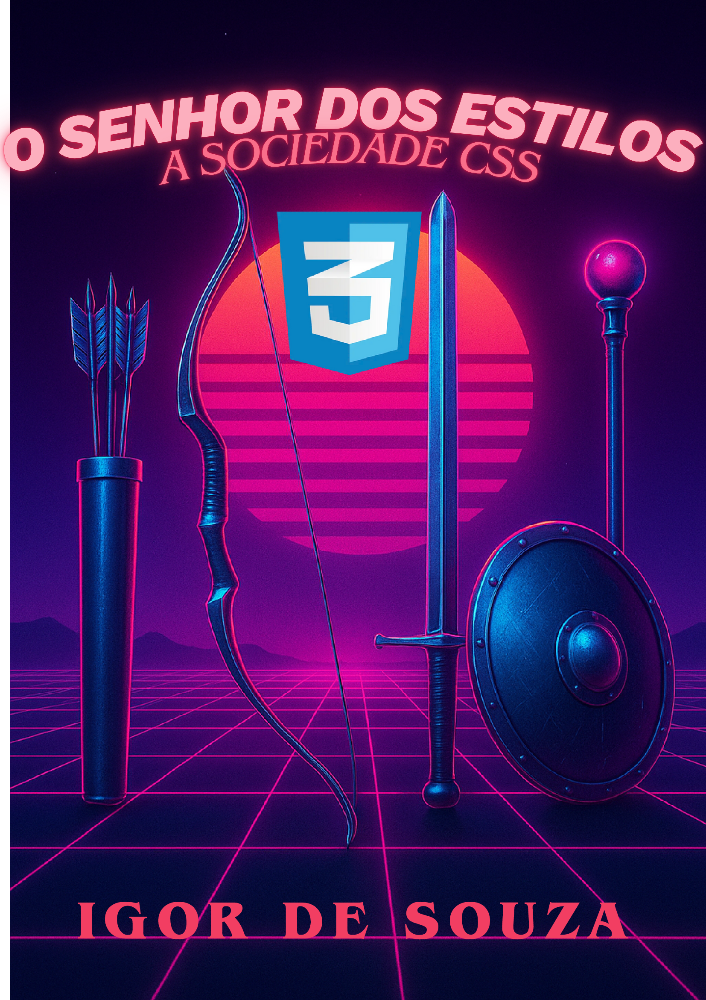

# 🧙‍♂️ O Senhor dos Estilos: A Sociedade do CSS  
### *Um guia mágico para dominar o poder dos estilos na Web*

---

## 📖 Sobre o Projeto

**“O Senhor dos Estilos: A Sociedade do CSS”** é um eBook criado para o curso de **IA Generativa da DIO em parceria com a Universia**.  
O objetivo deste projeto é demonstrar como a **inteligência artificial** pode ser usada para **criar materiais educativos e técnicos**, combinando **criatividade, didática e profundidade**.

O eBook apresenta o **CSS** de forma envolvente, clara e completa — desde os conceitos básicos até práticas avançadas de layout e responsividade.  
A narrativa é inspirada em **O Senhor dos Anéis**, transformando a jornada do aprendizado em uma aventura na Terra Média do código.

---

## 🧭 Objetivos do Projeto

- Ensinar **CSS** de forma **clara e acessível** para iniciantes.  
- Demonstrar o **uso da IA Generativa** na criação de conteúdo educacional.  
- Promover a integração entre **design, programação e IA**.  
- Inspirar novos criadores a usar IA de forma criativa e ética.  

---

## 🪶 Ferramentas e Tecnologias

| Ferramenta | Função |
|-------------|--------|
| 💬 **ChatGPT (GPT-5)** | Criação, expansão e revisão dos textos do eBook |
| 🎨 **Canva** | Criação da capa e elementos visuais |
| 💻 **Snappify** | Criação das imagens e ilustrações dos códigos |
| 📚 **Markdown / GitHub** | Documentação e publicação do projeto |
| 🧾 **DIO + Universia** | Contexto educacional e certificação do projeto |

---

## 💡 Prompts Utilizados na Criação

Durante o processo, foram usados diversos prompts cuidadosamente estruturados para orientar a IA.  
Abaixo estão alguns dos principais utilizados:

### 🧩 Estrutura Inicial
> “Crie um eBook com 6 capítulos introdutórios sobre CSS, explicando como se fosse um professor universitário, com exemplos, contextos e linguagem acessível.”

### 📚 Expansão de Conteúdo
> “Aumente as explicações, acrescente mais exemplos e detalhes técnicos. Explique cada conceito de forma completa — como margin, padding, seletores, cores, fontes e layouts.”

### 🧙 Revisão e Estilo Narrativo
> “Reescreva o conteúdo mantendo um tom leve, narrativo e educativo, inspirado no universo de O Senhor dos Anéis.”

### 🎨 Criação Visual
> “Sugira ideias de capa e diagramação com estética medieval e elementos mágicos, utilizando o Canva e o Snappify para gerar as artes.”

### ⚙️ Documentação Final
> “Crie um README profissional para o GitHub, explicando o propósito do eBook, as ferramentas usadas, os prompts e o contexto educacional (DIO / Universia).”

---

## 📘 Estrutura do eBook

O eBook é dividido em **6 capítulos principais**, com uma progressão pedagógica ideal para iniciantes:

| Capítulo | Título | Conteúdo Principal |
|-----------|---------|-------------------|
| 1 | O Chamado do Front-End | Introdução ao CSS e conceito de “cascata” |
| 2 | Estrutura da Magia | Sintaxe, propriedades e valores |
| 3 | A Irmandade dos Seletores | Tipos de seletores e usos práticos |
| 4 | As Propriedades Encantadas | Cores, fontes, espaçamento e bordas |
| 5 | Layouts: Estruturando o Reino | Flexbox, Grid e posicionamento |
| 6 | Responsividade e Boas Práticas | Media queries, transições e otimização |

---

## 🧠 Aprendizado com IA Generativa

Este projeto faz parte do curso **“IA Generativa”**, oferecido pela **DIO (Digital Innovation One)** em parceria com a **Universia**.  
Ele mostra como **modelos de linguagem avançados** podem atuar como **assistentes de ensino e criação**, ajudando na:

- **Organização e estruturação de conteúdo educacional.**  
- **Explicação de conceitos técnicos com clareza e didatismo.**  
- **Ajuste de tom, coesão e estilo narrativo.**  
- **Criação de analogias e metáforas para facilitar o aprendizado.**

---

## 🧩 Como Visualizar o eBook

O eBook está disponível para facilitar o acesso e a leitura:

| Formato | Descrição | Recomendado para |
|----------|------------|------------------|
| `.pdf` | Versão final diagramada com capa e imagens | Leitura em qualquer dispositivo |

📎 **Acesse o eBook completo:**  
➡️ [📘 O Senhor dos Estilos - A Sociedade do CSS (PDF)](./O-Senhor-dos-Estilos.pdf)

---

## 🧑‍💻 Autor & Contexto Acadêmico

📘 **Autor:** *Igor de Souza Aguiar*  
🎓 **Curso:** *IA Generativa com ChatGPT*  
🏛️ **Plataforma:** [Digital Innovation One (DIO)](https://www.dio.me)  
🤝 **Parceiro Educacional:** [Universia](https://www.universia.net)

---

## 💬 Contribuições

Contribuições são bem-vindas!  
Se quiser sugerir melhorias, abra uma *issue* ou envie um *pull request*.  
Toda sugestão de conteúdo, correção ou aprimoramento visual será apreciada.  

---

## 🪄 Licença

Distribuído sob a licença **MIT**.  
Você é livre para usar, estudar e adaptar este conteúdo para fins educacionais, desde que mantenha os devidos créditos.

---

### ✨ “Nem todo código que brilha é dourado.”  
Um tributo à magia dos estilos e à arte de ensinar com tecnologia.

---

📘 **Repositório:** [github.com/IgorSouzDEV/Ebook-DIO](https://github.com/IgorSouzDEV/Ebook-DIO)  
💻 **Criado com IA e paixão pelo front-end.**

